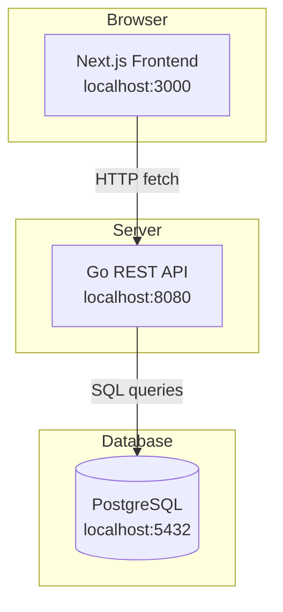
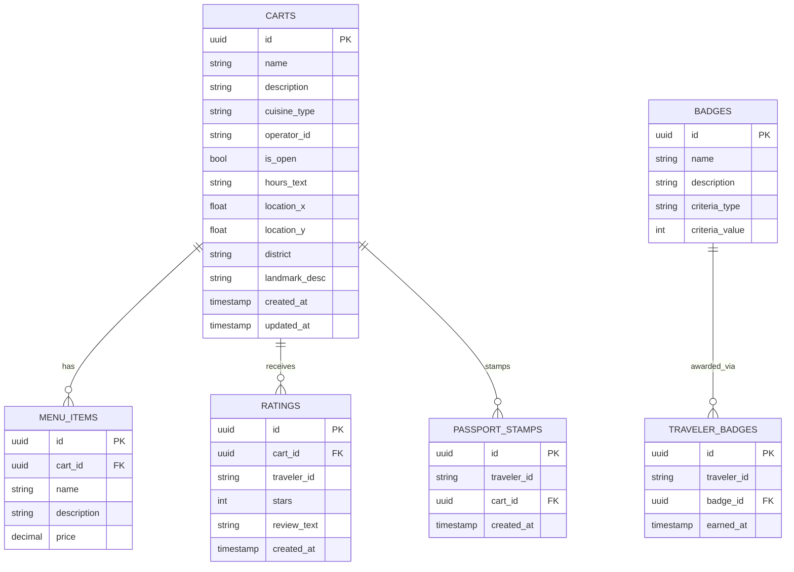

# Adventurer's Food-Cart Finder — Misthaven

> A fantasy-city food vendor directory for **Misthaven**, a fictional city suited for tabletop RPG settings. "Food trucks" are themed as wandering merchant carts, mobile alchemist stalls, and street vendors. The app fulfills a real-world work assignment but is dressed in a fantasy aesthetic.
>
> Primary objective: learn to use AI (Claude) to build a full-stack project soup-to-nuts.

---

## Original Assignment

> **Food Truck Finder**
> - Track food trucks in a city
> - Operators post location, menu & hours
> - Customers browse, view menus, leave ratings
>
> **Requirements:**
> - Two distinct user roles with different views
> - Basic CRUD functionality
> - Runs locally in a browser
> - Technology stack is your choice
> - Do not ask colleagues for guidance — work directly with Claude

---

## Concept & Theme

Misthaven is a bustling fantasy city where wandering merchants, alchemists, and street cooks hawk their wares from carts and stalls. Customers are "Travelers" exploring the city. Operators are "Merchants" managing their mobile stalls.

The map is a custom illustrated image of Misthaven (not a real-world map). Operators drop pins directly on the city map. Instead of Google Maps navigation, location is described by district and landmark (e.g., *"Dockside Quarter, near the Harbormaster's Guild"*).

---

## Tech Stack

| Layer | Technology | Notes |
|---|---|---|
| Frontend | Next.js (React) | UI only — no API routes |
| Backend | Go (REST API) | All business logic and DB access |
| Database | PostgreSQL | Relational, local instance |
| Map | Leaflet (`CRS.Simple`) | Custom image map, no API key needed |
| Auth (MVP) | Role selector | No accounts — browser session token in localStorage |
| Deployment (stretch) | Railway + Vercel | Free tier, auto-detects Go and Node |

**Local dev:** Three terminals — Postgres running locally, `go run` for the API on `:8080`, `npm run dev` for Next.js on `:3000`. No Docker required.

---

## Architecture



Next.js is a pure UI layer. All data lives in Go + Postgres. When real auth is added later, it slots into the Go layer without touching the frontend structure.

---

## User Roles

A **role selector toggle** in the UI controls which experience is shown. No login required for MVP. Each browser session gets a generated token stored in localStorage — this token acts as the user ID. When real auth arrives, the session token is swapped for a real user FK with no schema rework needed.

### Merchant (Operator)
- Create, edit, and delete their cart/stall listing
- Set name, description, cuisine type, and menu items
- Drop a pin on the Misthaven map
- Set hours and mark open/closed status
- View ratings left by Travelers

### Traveler (Customer)
- Browse all active carts on the Misthaven map
- View cart detail pages (menu, hours, district location)
- Leave a star rating and short review
- Earn passport stamps and badges

---

## Feature Phases

### Phase 1 — Foundation
- [x] Project scaffolding (Next.js + Go + Postgres)
- [x] Database schema and migrations
- [x] Role selector UI
- [x] Basic routing structure

> **Notes:** A `GET /v1/badges` endpoint was added as a stack validation check (frontend → API → DB), displaying the 5 seeded badges on the Traveler page. This will be removed or replaced once real Phase 3 features are built.

### Phase 2 — Merchant Core (CRUD)
- [x] Create / edit / delete a cart listing
- [x] Set location via pin drop on the Misthaven map
- [x] Set hours and open/closed status

### Phase 3 — Traveler Core (Browse)
- [ ] Map view showing all active cart pins
- [ ] Cart detail page (menu, hours, district/landmark description)
- [ ] Cart listing/search outside the map

### Phase 4 — Ratings & Reviews
- [ ] Star rating (1–5) per cart
- [ ] Short text review
- [ ] Aggregate rating displayed on cart cards and detail pages

### Phase 5 — The Passport (Gamification)
- [ ] Stamp earned per unique cart rated
- [ ] Badge system (see Gamification section below)
- [ ] Traveler passport page showing stamps and badges
- [ ] City leaderboard (top 10 by stamp count)

### Phase 6 — Polish
- [ ] Fantasy-themed UI (fonts, color palette, iconography)
- [ ] Mobile-responsive layout
- [ ] Empty states, loading states, error handling

### Phase 7 — Deployment (Stretch)
- [ ] Railway deployment of Go API + Postgres
- [ ] Vercel deployment of Next.js frontend
- [ ] Environment config for prod vs. local

---

## Data Model



---

## Gamification — The Passport

Travelers collect stamps by rating carts. Stamps unlock badges based on milestones and variety.

| Badge | Trigger |
|---|---|
| First Bite | Earn your first stamp |
| Street Sage | 10 stamps |
| Seasoned Wanderer | 25 stamps |
| Flavor Pilgrim | Rate carts from 5 different cuisine types |
| Dockside Regular | Rate 3 carts in the Dockside Quarter |
| *(more district and theme badges TBD)* | |

The **leaderboard** shows the top 10 Travelers by stamp count, city-wide.

---

## App Name Candidates

| Name | Vibe |
|---|---|
| **The Wandering Cauldron** | Evokes roving vendors, magical food |
| **Cobblestone** | Simple, market-city feel |
| **The Crier's Board** | Town crier announcing vendor locations |
| **Misthaven Market** | Straightforward, place-branded |
| **The Cartographer's Appetite** | Nods to the map mechanic |

---

## Git & Dev Workflow

```
main        ← stable, reviewed only
└── develop ← integration branch
    └── feature/<name>  ← one branch per feature
```

Claude works each feature autonomously on its own branch:
1. Build the feature
2. Write Playwright tests
3. Run tests and iterate until passing
4. Return for human review when the feature is PR-ready

Claude only stops mid-feature to ask design questions or flag decisions that need a developer judgment call.

---

## Design Decisions

| Question | Decision |
|---|---|
| **App name** | *Adventurer's Food-Cart Finder* (working title) |
| **Map image** | Generated — two versions available: `maps/Misthaven-normal.png` and `maps/Misthaven-sepia.png` |
| **Fantasy theming** | All in — UI says "carts", "stalls", "merchants", "travelers" throughout |
| **Cuisine naming** | Mix of modern food with fantasy-themed cart/stall names (e.g., *Eye of the Beholder BBQ*, *Dragon-Fired Pizza Lair*, *Frost Giant Frozen Treats*) |
| **Phase order** | Confirmed as-is |

## Fantasy World Building Information
### Map/city information
- Name: Misthaven
- City Quarter Names: Midheath, Peridozys, Beerside, Westheath, Aspenlane, Oakcorner
- Other Details
    - coastal city
    - sea to the north
    - river flowing out to the sea from the east
    - forest in the south-east
    - farm lands surround the city
    